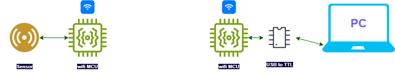

# Wireless Serial(UART) Transceiver

**Introduction :**

You can observe lots of sensor modules available ready to use like some energy metering IC (bl0940), mmWave occupancy sensor (LD2410D) etc. In these ICs you can directly send command through UART to configure it and get desired data. But you have noticed plying with sensor by serial terminal through you PC is not always feasible and convenient and in some cases sensor must be installed in field or in testing environment. 
I also faced one of the scenario like above where I was playing with mmwave sensor where I need the real time data from sensor and also have to send some command to sensor to configure it through my PC using vendor software and serial terminal application. So I build a solution for it to make this process wireless.

                                                                **Fig: Wireless Serial Transceiver**

**Firmware Part :**

1. I am using ESP NOW library to communicate between two MCUs wirelessly. Here is little introduction about ESP-NOW protocol by Espressif :

> ESP-NOW is a wireless communication protocol based on the data-link layer, which reduces the five layers of the OSI model to only one. This way, the data need not be transmitted through the network layer, the transport layer, the session layer, the presentation layer, and the application layer. Also, there is no need for packet headers or unpackers on each layer, which leads to a quick response reducing the delay caused by packet loss in congested networks.
> 
1. When MCU boot it checks the status of IO14 pin status. If IO14 is ground it will go into config mode. In config mode you can set the MAC address of MCU to which you want to communicate. If IO14 is not connected to ground on boot it will boot normally and start communicating with other MCU immediately.
2. MCU can send 250 bytes of serial data in one go wirelessly as limited by ESP NOW library.
3. I am using ESP8266 as MCU, FT23RL FTDL Mini USB to TTL Serial Converter and mmWave sensor in above diagram.
4. Let me know you test this code and any feedback appreciated…